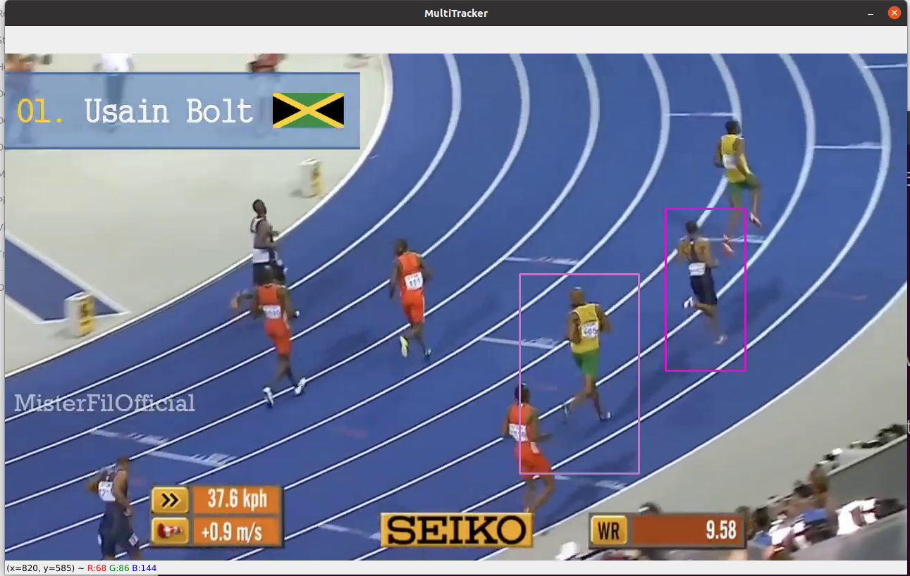

# Object Tracking Using Computer Vision

The "Object Tracking Using Computer Vision" repository features implementations of popular object tracking algorithms, such as 'BOOSTING', 'MIL', 'KCF', 'TLD', 'MEDIANFLOW', 'MOSSE', and 'CSRT'. This versatile collection enables multiple object tracking in both video streams and images, providing a practical toolkit for computer vision applications.

